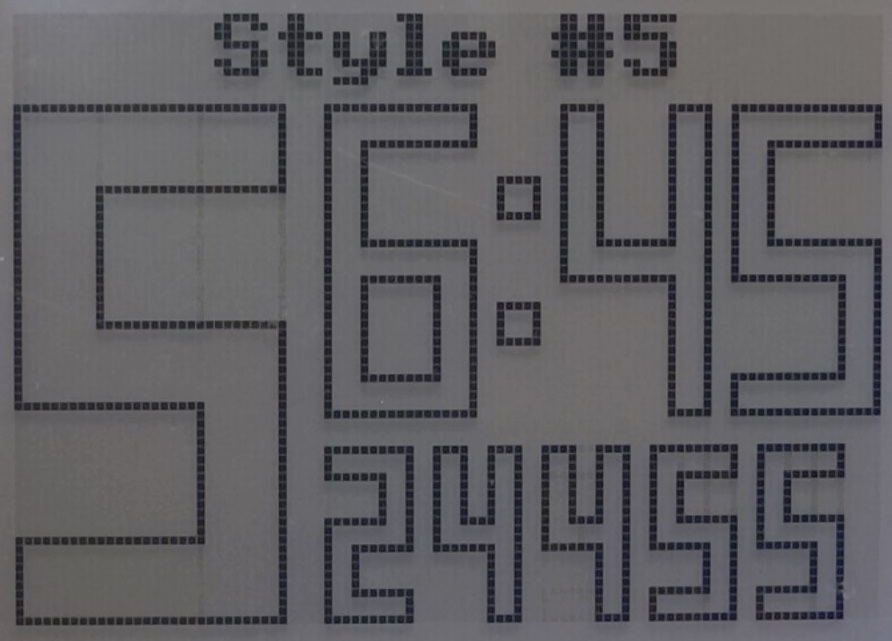

[![license-badge][]][license] ![version]  ![hit-count] [![github-issues][]][issues]

# DigiFont
Library for nice, scalable digits rendering using any Arduino GFX libraries 

YouTube videos:

https://youtu.be/X6PjfhcNE98

https://youtu.be/Z_YCfJZn_bA

## Features
- very fast rendering even on AVR Arduino
- no bitmap data is necessary - only rendering routines
- each number can have different width, height and segment thickness
- should work with any Arduino graphic library with user defined callbacks for drawLine() and fillRect()
- 3 styles of 7-segment font variation
- extra pseudo 3D look for color displays (style 2c)
- simple fast rectangular and outline styles
- each digit only cleans the necessary segments, so cleaning and refreshing the entire screen is not necessary (important for good performance on high definition LCD displays)
- examples for monochrome HX1230 and color ST7789 IPS
- each style has separate methods/functions to save program memory
- if necessary only 3-4 functions can be used separately (setSize,drawSeg,drawDigit,printNumber) without the library
- special look - multi layer rendering is possible: https://youtu.be/OPq9aBJP-pc
- new 7-segment style #7 where look of segment can be defined using extra parameter (can replace styles #1 and #2)

## Last changes
- styles 1 and 2/2c are now obsolete, use them only if you need lower memory usage, use style 7 instead
- style 7 supports now 2 colors similar to style 2c
- setSize7(50,100,13,6) is equivalent for setSize2(50,100,13)
- setSize7(50,100,13,0) is equivalent for setSize1(50,100,13) but setSize7(50,100,13,2) gives nicer look
- style 4 and 5 are renamed to F (filled) and O (outline) but old names left for compatibility

## Program memory usage
|Style|Usage|Info|Example|
|--|--|--|--|
|style 1|1576|7-segment style #1||
|style 2|1398|7-segment style #2||
|style 2c|1628|2 color version for pseudo 3D look||
|style 3|1228|simple rectangle segments for low memory applications||
|style 4/F|3060|filled||
|style 5/O|5266|outline||
|style 7|1838|versatile replacement for style 1 and 2/2c||

If you find it useful and want to buy me a coffee or a beer:

https://buycoffee.to/cbm80

https://www.paypal.me/cbm80amiga

[license-badge]: https://img.shields.io/badge/License-GPLv3-blue.svg
[license]:       https://choosealicense.com/licenses/gpl-3.0/
[version]:       https://img.shields.io/badge/Version-1.1.0-green.svg
[hit-count]:     https://hits.seeyoufarm.com/api/count/incr/badge.svg?url=https%3A%2F%2Fgithub.com%2Fcbm80amiga%2FDigiFont&count_bg=%2379C83D&title_bg=%23555555&icon=&icon_color=%23E7E7E7&title=hits&edge_flat=false
[github-issues]: https://img.shields.io/github/issues/cbm80amiga/DigiFont.svg
[issues]:        https://github.com/cbm80amiga/DigiFont/issues/
